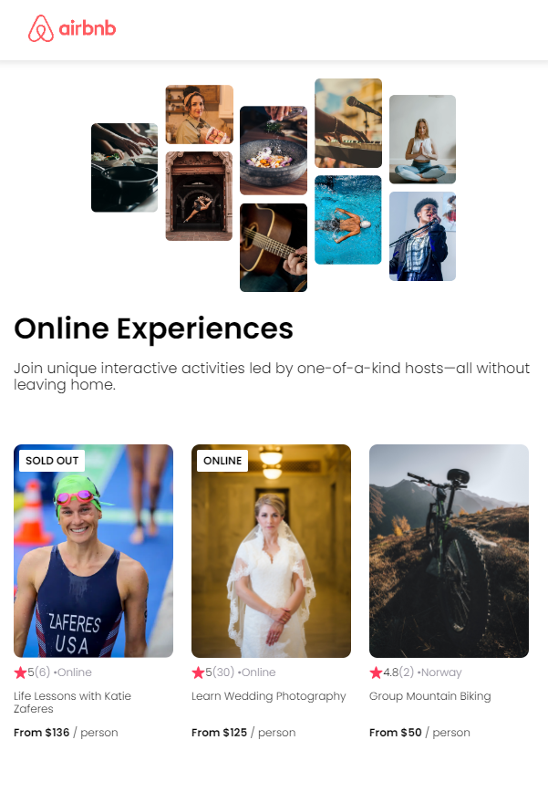

# AirBNB Experiences

Developed by following React Tutorial by [Scrimba](https://scrimba.com/learn/learnreact).



## Project Content

- JSX
- ReactDOM.render() and .createRoot()
- Custom components
- Organizing components
- Reusable components
- JS inside JSX
- Props
- Destructuring props
- Rendering arrays
- Mapping components
- Key prop
- Passing objects as props
- Spreading objects as props

## Quick start:

```
$ yarn # npm install
$ yarn build # npm run build
````

## Development

```
$ yarn watch # npm run watch
```
