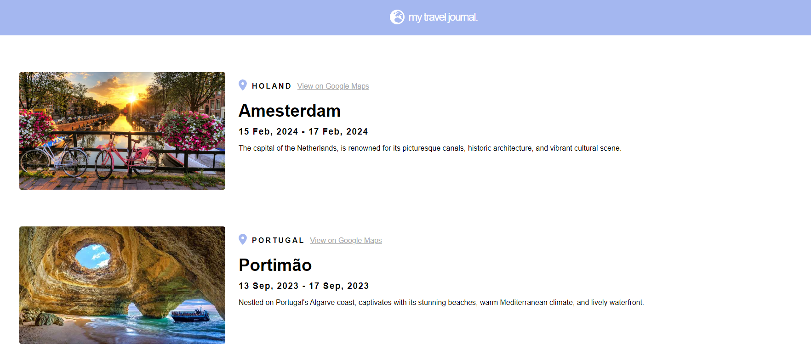

# Travel Journal App

Developed by following React Tutorial by [Scrimba](https://scrimba.com/learn/learnreact).

Test out this app in [Netlify](https://main--travel-journal-react-00.netlify.app/)

## Project Content

- JSX
- ReactDOM.render() and .createRoot()
- Custom components
- Organizing components
- Reusable components
- JS inside JSX
- Props
- Destructuring props
- Rendering arrays
- Mapping components
- Key prop
- Passing objects as props
- Spreading objects as props

## Quick start:

This template provides a minimal setup to get React working in Vite with HMR and some ESLint rules.

Currently, two official plugins are available:

- [@vitejs/plugin-react](https://github.com/vitejs/vite-plugin-react/blob/main/packages/plugin-react/README.md) uses [Babel](https://babeljs.io/) for Fast Refresh
- [@vitejs/plugin-react-swc](https://github.com/vitejs/vite-plugin-react-swc) uses [SWC](https://swc.rs/) for Fast Refresh
